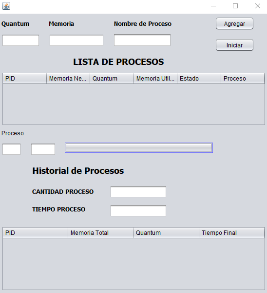
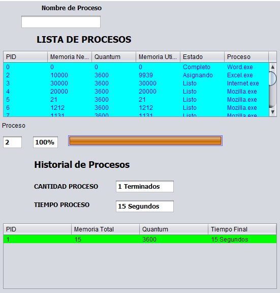

<!---Encabezado-->
# PROYECTO 2
---
### Ejecutaremos el programa y nos aparecerá esta ventana.
---

En el programa tendremos el Quantum, la memoria y el nombre del proceso. Ingresamos la informacion necesaria y le daremos en el boton agregar
Agregaremos varios procesos con la informacion necesaria y nos aparecerá la lista de procesos.

Si ingresamos un bloque de memoria de mas de 4000000 KB mostrará un error y no añadira el proceso.

Si sobrepasamos la memoria que tiene 2048 MB, nos mostrara este error.

El programa solo nos dejara ingresar 15 procesos.

Cuando tenemos los 15 procesos el programa comenzara a ejecutarlos cuando se presione el boton iniciar.

Cuando los procesos vayan siendo finalizados se encontraran en la parte de historial de procesos

En el programa aparecera si esta completo, asignado o en espera y también listo para ejecutar

Cuando todos los programas han sido procesados nos aparecera el historial de procesos terminados.

